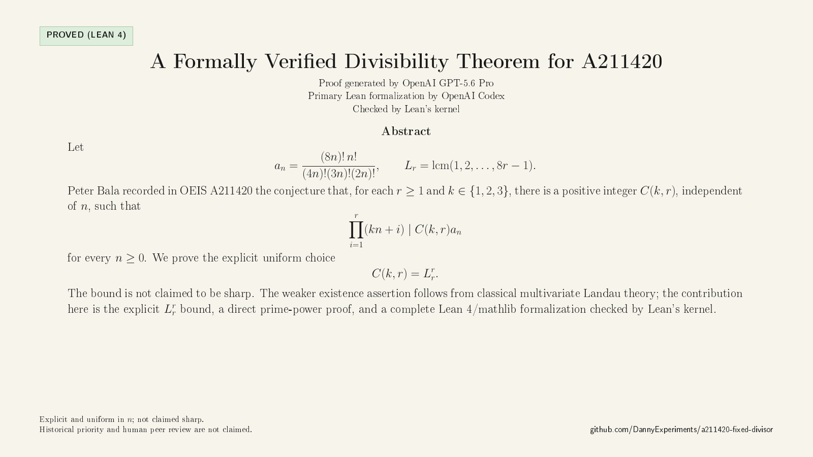

# A211420 fixed-divisor theorem

[](https://github.com/DannyExperiments/a211420-fixed-divisor/actions/workflows/lean.yml)
[](https://github.com/DannyExperiments/a211420-fixed-divisor/actions/workflows/pdf.yml)

This repository contains a readable mathematical proof and a kernel-checked
Lean 4 formalization of the following strengthening of the fixed-divisor
conjecture recorded in OEIS A211420.

For

\[
a_n=\frac{(8n)!n!}{(4n)!(3n)!(2n)!},\qquad
L_r=\operatorname{lcm}(1,2,\ldots,8r-1),
\]

the formalized theorem states that, for every `n >= 0`, `r >= 1`, and
`k in {1,2,3}`,

\[
\prod_{i=1}^{r}(kn+i)\mid L_r^r a_n.
\]

The Lean development first proves factorial-ratio integrality and the
division-free statement

\[
\left(\prod_{i=1}^{r}(kn+i)\right)(4n)!(3n)!(2n)!
\mid L_r^r(8n)!n!,
\]

then derives the quotient corollary. It also proves `L_r^r > 0`.

## Known background and precise contribution

The integrality of `a_n` was already known: it is the `a = 4, b = 1`
specialization of family (8) in Jonathan W. Bober, “Factorial ratios,
hypergeometric series, and a family of step functions,” *Journal of the
London Mathematical Society* 79 (2009), Theorem 1.2
([arXiv:0709.1977](https://arxiv.org/abs/0709.1977),
[DOI 10.1112/jlms/jdn078](https://doi.org/10.1112/jlms/jdn078)).
This repository formalizes that integrality rather than assuming it.

The weaker assertion that, for every fixed `k ∈ {1,2,3}` and `r ≥ 1`,
some positive constant `C(k,r)` exists is obtainable from Landau's
multivariate factorial-ratio criterion after a two-variable specialization;
for example, the coarser constant `((8*r)!)^r` works. That background
consequence is not claimed as new.

The result proved and formally verified here is the explicit stronger bound

```text
C(k,r) = L_r^r,  L_r = lcm(1,...,8r-1),
```

together with a direct prime-power proof. No claim is made that this constant
is minimal or historically new. No prior source for the full `L_r^r`
strengthening was found in the searches conducted.

Earlier exact or closely related special cases include
`(3*n+1) ∣ 5*a_n`, obtained from Zhi-Wei Sun's
[Theorem 1.3(ii)](https://doi.org/10.1017/S1446788712000171), and
`(2*n+1)*(2*n+3) ∣ 99*a_n`, obtained from Quan-Hui Yang's
[Theorem 1](https://arxiv.org/abs/1401.1108) with `a=4,b=1`. Yang's
second factor is `2*n+3`, so it is not the consecutive `r=2` product in
the theorem here.

## Two primary files

- [Readable solution PDF](paper/a211420_formalized.pdf)
- [Lean formalization](A211420.lean)

## Announcement graphic

[](social/a211420_announcement_1600x900.png)

The [announcement graphic](social/a211420_announcement_1600x900.png)
summarizes only the theorem formalized in [`A211420.lean`](A211420.lean).

## Verify locally

The project pins Lean 4.30.0 and mathlib v4.30.0.

```bash
./scripts/verify.sh
```

The verification script runs `lake build` and rejects `sorry`, `admit`, new
project axioms, and unsafe declarations in project Lean files. GitHub CI also
replays the compiled module through Lean 4.30's bundled `leanchecker`.

The principal declarations are:

- `A211420.integral_cross`
- `A211420.strengthened_cross`
- `A211420.constant_pos`
- `A211420.ADen_mul_a`
- `A211420.strengthened`

## Separate Aristotle formalization

Aristotle (Harmonic) generated a separate second machine formalization that
was received after the primary Codex formalization was complete. Its exact
downloaded archive, original Lean 4.28.0 project metadata, and 278-line
`Main.lean` are preserved under
[`independent/aristotle/`](independent/aristotle/). The unchanged source
also compiles under this repository's Lean/mathlib 4.30.0 environment;
`./scripts/verify.sh` checks both implementations.

The exact Aristotle input prompt could not be recovered from the dashboard,
which displays only a truncated task title. The repository therefore does not
claim independent generation or independent reproduction. See
[`independent/aristotle/PROVENANCE.md`](independent/aristotle/PROVENANCE.md).
The second source is not human peer review and was not a dependency of the
already completed primary proof.

## Computational verification

The exact C++ valuation checker
[`checks/A211420_padic_audit.cpp`](checks/A211420_padic_audit.cpp) tested
`0 ≤ n ≤ 10000`, `1 ≤ r ≤ 1000`, and all three values of `k`: 30,003,000
triples and 75,347,906 prime-valuation updates, with no counterexample. A
separate direct Python checker tested 27,180 triples and 2,636,460 prime
inequalities. Sources and logs are preserved in [`checks/`](checks/).

These finite computations are corroborative only. The Lean theorem is
universal and does not use finite checking as proof.

## AI disclosure and attribution

The ordinary-language proof of the explicit `L_r^r` strengthening was
generated by OpenAI GPT-5.6 Pro. OpenAI Codex produced the primary Lean 4
formalization and repository infrastructure; Lean's kernel checked the
development in the pinned environment. A separate second Lean formalization
was generated by Aristotle (Harmonic). Danny initiated, curated, and
published the project.

Four GPT-5.6 Pro adversarial audit runs are preserved in [`audits/`](audits/).
They are AI-generated checks, not human peer review. The two fresh instances
reported larger exact searches and reached the same corrected-theorem verdict;
their shared-page transcripts are archived verbatim in plain text.

See [AI_DISCLOSURE.md](AI_DISCLOSURE.md) for the full contribution statement.

## Scope

The displayed theorem is kernel-checked. This repository does **not** claim:

- historical priority or a certified first proof;
- human peer review;
- minimality of the constant `L_r^r`; or
- formal verification of additional variants mentioned in research drafts.

No prior source for the exact `L_r^r` strengthening was found in the supplied
searches, but absence from a bounded search is not evidence of originality.
